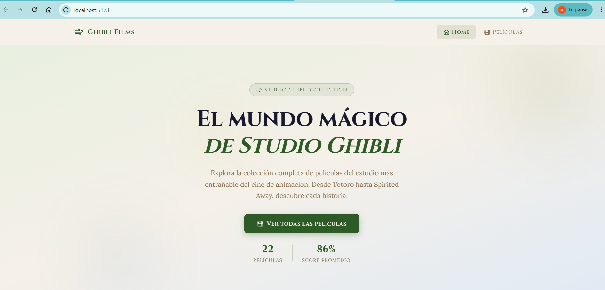
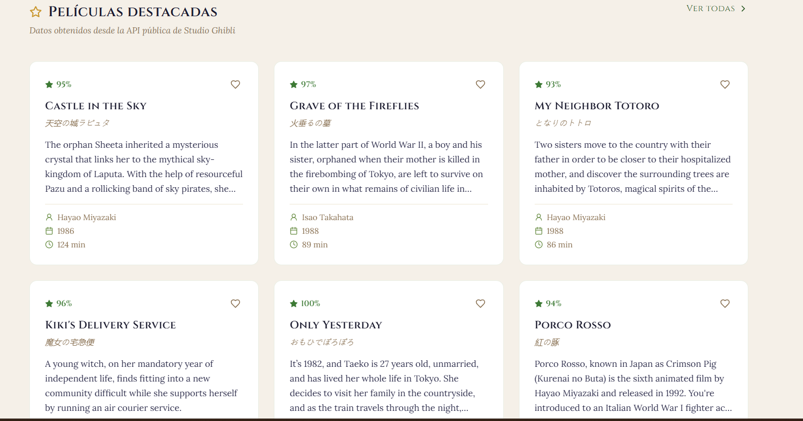
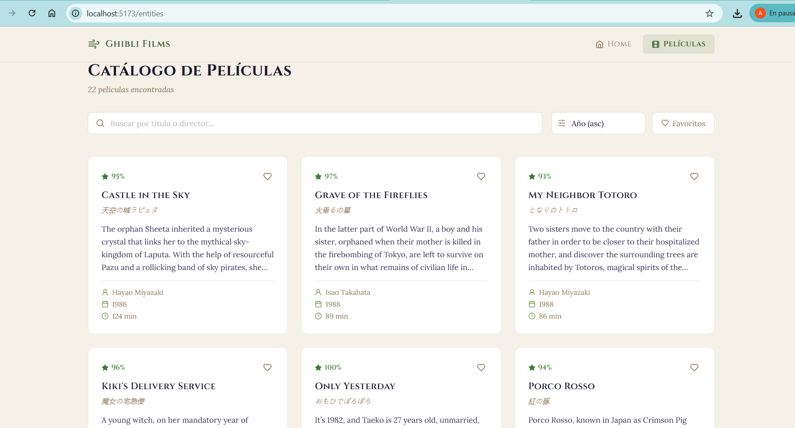
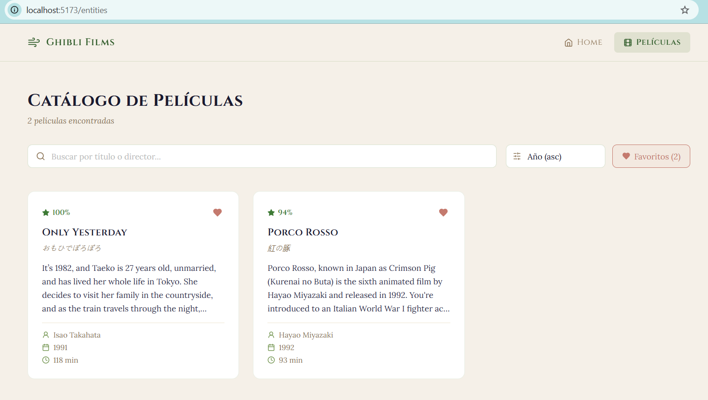

#  Ghibli Films

> Aplicación web React que consume la API pública de Studio Ghibli y muestra el catálogo completo de películas con título, director, año, puntuación y descripción.

   

---

##  Descripción

**Ghibli Films** es una SPA (Single Page Application) desarrollada con React 19 y Vite que consume la [API pública de Studio Ghibli](https://ghibliapi.vercel.app/films). Permite explorar todas las películas del estudio, buscar y filtrar resultados, y guardar favoritos de forma persistente con `localStorage`.

---

## 🚀 Tecnologías utilizadas

| Herramienta | Versión | Uso |
|---|---|---|
| [React](https://react.dev) | 19 | UI y componentes |
| [Vite](https://vitejs.dev) | 5 | Bundler y dev server |
| [React Router DOM](https://reactrouter.com) | 6 | Navegación entre rutas |
| [Axios](https://axios-http.com) | 1.7 | Consumo de API HTTP |
| [Lucide React](https://lucide.dev) | 0.383 | Iconografía |
| CSS Modules | — | Estilos por componente |

---

## ⚙️ Requisitos funcionales implementados

| Funcionalidad | Estado |
|---|---|
| ✅ Configuración con Vite | Completo |
| ✅ Consumo de API pública (`/films`) | Completo |
| ✅ Ruta `/` — Hero + listado destacado | Completo |
| ✅ Ruta `/entities` — Catálogo completo con filtros | Completo |
| ✅ Navegación con React Router | Completo |
| ✅ Favoritos con localStorage | Completo |
| ✅ Notificaciones toast | Completo |
| ✅ Loader y estados de carga/error | Completo |
| ✅ Diseño responsive | Completo |

---

## 📂 Estructura del proyecto

```
ghibli-react/
├── src/
│   ├── components/
│   │   ├── Navbar.jsx / .css
│   │   ├── Footer.jsx / .css
│   │   ├── FilmCard.jsx / .css
│   │   └── Loader.jsx
│   ├── hooks/
│   │   └── useGhibliFilms.js   ← hook personalizado (fetch + favoritos)
│   ├── lib/
│   │   └── toast.jsx            ← contexto de notificaciones
│   ├── pages/
│   │   ├── Home.jsx / .css      ← ruta "/"
│   │   ├── Entities.jsx / .css  ← ruta "/entities"
│   │   └── NotFound.jsx / .css  ← ruta 404
│   ├── App.jsx
│   ├── main.jsx
│   └── index.css
├── index.html
├── vite.config.js
└── package.json
```

---

## 🛠️ Pasos para ejecutar el proyecto

**1. Clonar el repositorio**
```bash
git clone https://github.com/alexandersanabria-lang/ghibli-react
cd ghibli-react
```

**2. Instalar dependencias**
```bash
npm install --legacy-peer-deps
```

**3. Iniciar el servidor de desarrollo**
```bash
npm run dev
```
La app estará disponible en: **http://localhost:5173**

**4. Compilar para producción**
```bash
npm run build
```


## 🎥 Video demostrativo

> 📺 **[Ver video en YouTube →](https://youtu.be/4-JnbRKFsfY)**

## 📋 Propiedades mostradas por película

1. **Título** (`title`) y título original (`original_title`)
2. **Director** (`director`)
3. **Año de estreno** (`release_date`)
4. **Puntuación** (`rt_score`)
5. **Duración** (`running_time`)
6. **Descripción** (`description`)

## 📸 Capturas

### Home


### Películas destacadas


### Catálogo de películas


### Favoritos y notificaciones



---
*API: [https://ghibliapi.vercel.app](https://ghibliapi.vercel.app) — Studio Ghibli Films*
